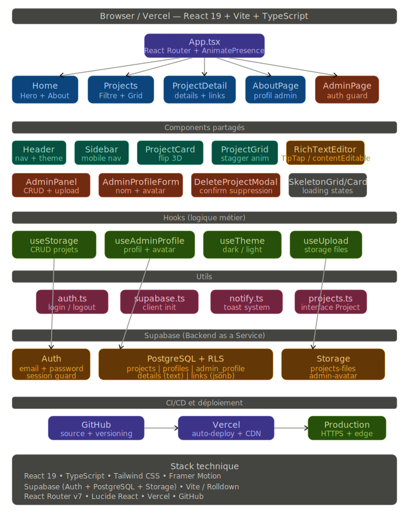

# Portfolio Cybersécurité — Lignting




> Portfolio technique personnel dédié à la cybersécurité offensive et défensive, à l'administration systèmes & réseaux, et au développement web.  
> Déployé en production sur Vercel, alimenté en temps réel par Supabase.

[](https://vercel.com)
[](https://supabase.com)
[](https://react.dev)
[](https://www.typescriptlang.org)
[](https://tailwindcss.com)

---

## Sommaire

- [Présentation](#-présentation)
- [Fonctionnalités](#-fonctionnalités)
- [Architecture](#-architecture)
- [Stack technique](#-stack-technique)
- [Structure du projet](#-structure-du-projet)
- [Base de données](#-base-de-données-supabase)
- [Installation locale](#-installation-locale)
- [Variables d'environnement](#-variables-denvironnement)
- [Déploiement](#-déploiement)

---

## Présentation

Portfolio développé de A à Z pour documenter et présenter des projets réels en cybersécurité : labs virtualisés, outils d'intrusion, supervision SOC, audit réseau et plus.

L'administration du contenu est entièrement gérée via un panneau admin sécurisé (authentification Supabase), permettant d'ajouter, modifier et supprimer des projets avec images, PDF, liens et descriptions enrichies (rich text).

---

## Fonctionnalités

### Côté visiteur
-  **Cartes de projets 3D** avec effet flip animé (Framer Motion)
-  **Filtrage par catégorie** en temps réel
-  **Page détail** par projet avec galerie d'images, rich text, liens dynamiques et PDF
-  **Thème dark/light** persistant (localStorage)
-  **Responsive** — sidebar mobile animée
-  **Skeleton loading** pendant le chargement Supabase

### Côté admin
-   **Authentification sécurisée** via Supabase Auth
- Déconnexion automatique à la perte de focus de l'onglet
- **Éditeur rich text** (gras, italique, souligné, couleur)
- Upload de miniature, galerie d'images (6 max), PDF
- Ajout de **liens dynamiques** personnalisés par projet
- Modification et suppression avec confirmation modale
- Gestion du profil admin (nom + avatar)

---

## Architecture

```
Browser (Vercel)
      │
      ▼
  App.tsx ──── React Router v7
      │
      ├── Pages
      │     ├── Home (Hero + About + Projets récents)
      │     ├── Projects (grille filtrée)
      │     ├── ProjectDetail (détail + rich text + liens)
      │     ├── AboutPage (profil admin)
      │     └── AdminPage (auth guard → AdminPanel)
      │
      ├── Components
      │     ├── ProjectCard (flip 3D)
      │     ├── ProjectGrid (stagger animation)
      │     ├── RichTextEditor (contentEditable)
      │     ├── AdminPanel (CRUD complet)
      │     └── AdminProfileForm (nom + avatar)
      │
      ├── Hooks
      │     ├── useStorage      → CRUD projets Supabase
      │     ├── useAdminProfile → profil + upload avatar
      │     ├── useTheme        → dark/light
      │     └── useUpload       → storage fichiers
      │
      └── Supabase (BaaS)
            ├── Auth        — email/password + session
            ├── PostgreSQL  — projects, profiles, admin_profile
            └── Storage     — projects-files, admin-avatar
```

---

## Stack technique

| Technologie          |                     Rôle                      |
|----------------------|-----------------------------------------------|
| **React 19**         | Framework UI                                  |
| **TypeScript 5.9**   | Typage statique                               |
| **Tailwind CSS 3.4** | Styles utilitaires                            |
| **Framer Motion**    | Animations (flip, stagger, page transitions)  |
| **React Router v7**  | Routage SPA                                   |
| **Supabase**         | Auth + PostgreSQL + Storage                   |
| **Vite / Rolldown**  | Bundler et dev server                         |
| **Lucide React**     | Icônes                                        |
| **Vercel**           | Hébergement + CI/CD                           |
| **GitHub**           | Versioning + source                           |

---

## Structure du projet

```
src/
├── components/
│   ├── Header.tsx           # Navigation sticky + toggle thème
│   ├── Sidebar.tsx          # Menu mobile animé
│   ├── Hero.tsx             # Section d'accueil
│   ├── About.tsx            # Profil + compétences
│   ├── ProjectCard.tsx      # Carte flip 3D
│   ├── ProjectGrid.tsx      # Grille avec stagger animation
│   ├── AdminPanel.tsx       # Panneau CRUD admin
│   ├── AdminProfileForm.tsx # Formulaire profil admin
│   ├── RichTextEditor.tsx   # Éditeur rich text (details)
│   ├── SkeletonCard.tsx     # Placeholder loading
│   ├── SkeletonGrid.tsx     # Grille de placeholders
│   └── Footer.tsx           # Liens sociaux
│
├── pages/
│   ├── Projects.tsx         # Liste filtrée de tous les projets
│   ├── ProjectDetail.tsx    # Détail d'un projet (/:id)
│   ├── AboutPage.tsx        # Page à propos
│   ├── AdminPage.tsx        # Page admin (login + panel)
│   └── NotFoundPage.tsx     # 404
│
├── hooks/
│   ├── useStorage.ts        # CRUD projets (Supabase)
│   ├── useAdminProfile.tsx  # Profil admin (Supabase)
│   ├── useTheme.tsx         # Gestion dark/light
│   └── useUpload.ts         # Upload fichiers (Storage)
│
├── utils/
│   ├── supabase.ts          # Initialisation client Supabase
│   ├── auth.ts              # login / logout / getUser
│   └── notify.ts            # Système de toasts personnalisé
│
├── data/
│   └── projects.ts          # Interface TypeScript Project
│
├── App.tsx                  # Routeur principal + layout
├── main.tsx                 # Point d'entrée React
└── index.css                # Variables CSS + Tailwind + .tiptap-render
```

---

## Base de données Supabase

### Tables

#### `projects`

|   Colonne     |    Type   |           Description             |
|---------------|-----------|-----------------------------------|
| `id`          | uuid      | Identifiant unique                |
| `title`       | text      | Titre du projet                   |
| `description` | text      | Résumé court                      |
| `details`     | text      | Contenu rich text (HTML)          |
| `category`    | text      | Catégorie (ex: Pentest, SOC…)     |
| `thumbnail`   | text      | URL miniature principale          |
| `images`      | text[]    | Galerie d'images (max 6)          |
| `pdf`         | text      | URL du rapport PDF                |
| `github_url`  | text      | Lien GitHub                       |
| `links`       | jsonb     | Liens dynamiques `[{label, url}]` |
| `created_at`  | timestamp | Date de création                  |


#### `admin_profile`

|    Colonne   |    Type   |      Description     |
|--------------|-----------|----------------------|
| `id`         | uuid      | Identifiant unique   |
| `name`       | text      | Nom affiché          |
| `avatar`     | text      | URL de l'avatar      |
| `updated_at` | timestamp | Dernière mise à jour |

### RLS (Row Level Security)

Toutes les tables ont le RLS activé :

- **Lecture projets** : publique (`true`)
- **Écriture projets** : admin uniquement (`is_admin()`)
- **Lecture admin_profile** : publique (`true`)
- **Modification admin_profile** : admin uniquement (`is_admin()`)

---

## Installation locale

### Prérequis

- Node.js ≥ 18
- Un projet Supabase créé

### Étapes

```bash
# 1. Cloner le dépôt
git clone https://github.com/NIN-12/portfolio.git
cd portfolio

# 2. Installer les dépendances
npm install

# 3. Configurer les variables d'environnement
cp .env.example .env
# → remplir VITE_SUPABASE_URL et VITE_SUPABASE_ANON_KEY

# 4. Lancer en développement
npm run dev
```

---

## Variables d'environnement

Créer un fichier `.env` à la racine :

```env
VITE_SUPABASE_URL=https://xxxxxxxxxxxx.supabase.co
VITE_SUPABASE_ANON_KEY=votre_anon_key
```

> Ne jamais committer le fichier `.env`. Il est dans `.gitignore` par défaut.

---

## Déploiement

Le projet est configuré pour un déploiement automatique via **Vercel** :

1. Pusher sur la branche `main` → Vercel déclenche automatiquement le build
2. Ajouter les variables d'environnement dans le dashboard Vercel
3. Le build Vite génère le dossier `dist/` — Vercel le sert via son CDN edge

```bash
# Build de production local
npm run build

# Prévisualisation locale du build
npm run preview
```

---

## Auteur

**Ariel LAWSON-TYCHUS**  
Étudiant en Master 1 — Systèmes, Réseaux et Sécurité  
Passionné de cybersécurité offensive et défensive

[](https://github.com/NIN-12)

---

## Licence

Ce projet est open source — libre d'usage à des fins d'apprentissage et de référence.
